# NovelCraft — Feature Guide & User Manual (English Edition)

> Version: 1.1.0 ｜ Updated: 2026-09-10
> Platform: Windows 10/11 (.NET 8.0 WPF desktop application)
> Screenshots: captured from the live English UI (en-US, Sept 10, 2026) — see `images_en/`

---

## Table of Contents

1. [Overview](#1-overview)
2. [Quick Start](#2-quick-start)
3. [Switching the Interface Language](#3-switching-the-interface-language)
4. [Page-by-Page Guide](#4-page-by-page-guide)
   - 4.1 Dashboard
   - 4.2 Project Management
   - 4.3 Project Overview
   - 4.4 Volumes & Chapters
   - 4.5 World Settings (Worldbuilding)
   - 4.6 Plot Management
   - 4.7 Character Management
   - 4.8 Relationship Network
   - 4.9 Faction Management
   - 4.10 Cultivation System
   - 4.11 One-Click Book Generation
   - 4.12 Long-Form Batch Generation
   - 4.13 AI Copilot
   - 4.14 AI Model Configuration
   - 4.15 Dialogue Generator
   - 4.16 Consistency Check (Project Health Report)
   - 4.17 Import / Export
   - 4.18 Publishing & Maintenance
   - 4.19 Statistics Report
5. [AI Chapter Polish & Continue-Writing](#5-ai-chapter-polish--continue-writing)
6. [Using a Remote RWKV Service](#6-using-a-remote-rwkv-service)
7. [FAQ](#7-faq)

---

## 1. Overview

NovelCraft (书籍管理系统) is an intelligent book-writing and management platform built on **C# / .NET 8.0 WPF**, designed for long-form novel authors. Powered by multi-Agent AI collaboration with a locally-hosted RWKV large language model, it covers:

- **Project Management** — manage multiple book projects with genre/status/statistics at a glance
- **Content Creation** — structured volume/chapter editing with AI polishing, continue-writing and dialogue generation
- **Setting Systems** — 20+ worldbuilding dimensions: worldview, cultivation system, politics, professions, justice, population, treasures, dimensions, maps, pets, equipment, techniques, business, timeline
- **AI Pipeline** — a five-stage creation pipeline (Synopsis → Plot Lines → Volumes → Chapter Drafts → Chapter Text), one-click book generation and long-form batch generation
- **Quality Assurance** — consistency checking, project health report and aggregated statistics
- **Operations** — local SQLite storage, automatic backup, health check, diagnostic bundle export
- **Bilingual UI** — full Chinese/English interface with system-language detection and in-app manual switching

### Tech Stack

| Layer | Technology |
| --- | --- |
| UI | WPF (.NET 8.0), UIAutomation |
| Application | DI (Microsoft.Extensions.DependencyInjection), Serilog |
| Domain | project/volume/chapter/character/faction/setting domain services |
| Infrastructure | SQLite + EF Core, RWKV llama.cpp inference service |
| AI | RWKV (local-first), OpenAI / DeepSeek / Ollama (optional) |

---

## 2. Quick Start

1. **Launch**: double-click `NovelManagement.WPF.exe`.
2. **Unlock**: the launch-verification window asks for the launch password (provided with the delivery). The factory default is `RWKV7_20260908`.
3. **Create**: click "＋ New Project" on the Dashboard, fill in the title and genre, then click "Create Project".
4. **Open**: the new project appears in the sidebar under *Project Management*; expand it to reveal the full function tree.
5. **AI (optional)**: on the *AI Model Configuration* page, ensure the RWKV inference service shows *Online*. Pure manual writing works without it.
6. **Write**: build the book skeleton via World Settings → Plot → Volumes, or simply chat with the AI Copilot.

### Requirements

- Windows 10/11 x64, .NET 8.0 Desktop Runtime
- (Optional) RWKV inference service: local llama.cpp or a remote tunnel — see Section 6
- Data directory: `%LocalAppData%\NovelManagement` (database, logs, backups, user configuration)

---

## 3. Switching the Interface Language

NovelCraft ships with a complete bilingual (Chinese / English) interface.

**Automatic detection (default)** — on first launch the app follows the Windows display language: `zh-*` → Chinese, anything else → English.

**Manual switching** — click the **language toggle button in the title bar** (shows `EN` when the UI is Chinese, `中` when the UI is English):

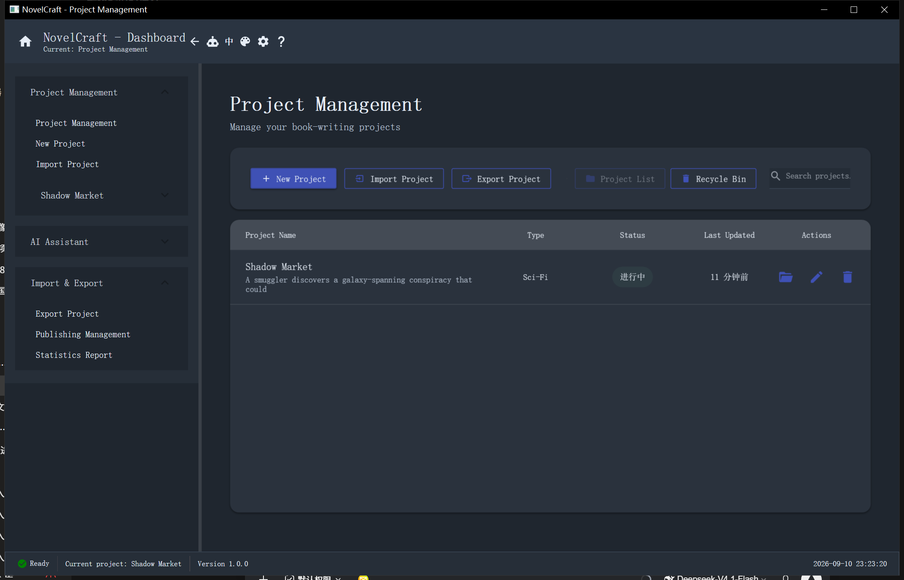

- The switch applies **immediately**: window titles, sidebar navigation, menus, buttons, tooltips and dialogs all refresh in place (elements bound via DynamicResource).
- The choice is **persisted** to `%LocalAppData%\NovelManagement\config\appsettings.user.json` under `Localization:Language` (`zh-CN` / `en-US`) and survives restarts.
- To return to system-language detection, remove the `Localization` node from that file.
- Already-open modal dialogs created before the switch show their old language until reopened.

Example `appsettings.user.json`:

```json
{
  "Localization": { "Language": "en-US" },
  "AI": { "Providers": { "RWKV": { "BaseUrl": "https://your-tunnel.trycloudflare.com" } } }
}
```

---

## 4. Page-by-Page Guide

### 4.1 Dashboard


The launch page. Offers quick actions (**New Project / Import Project / AI Copilot**), a project overview card (total words & chapters) and a recent-activity timeline. The title bar carries the language toggle (`中`/`EN`), copilot, theme, AI-config, and help buttons.

### 4.2 Project Management

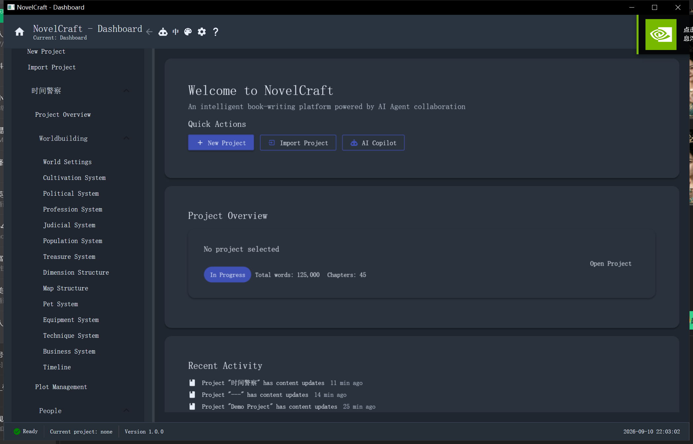

The project hub shown expanded in the sidebar. Toolbar offers New / Import / Export / List / Recycle Bin / Search. Each row shows genre, status, last-updated time and three icon actions: **Open, Edit, Delete** (soft-delete to Recycle Bin). Expanding a project node reveals its full function tree (Project Overview, Worldbuilding group, Plot, People group, Faction, Volumes & Chapters).

> Tip: hover a toolbar icon to see its function name as a tooltip.

### 4.3 Project Overview

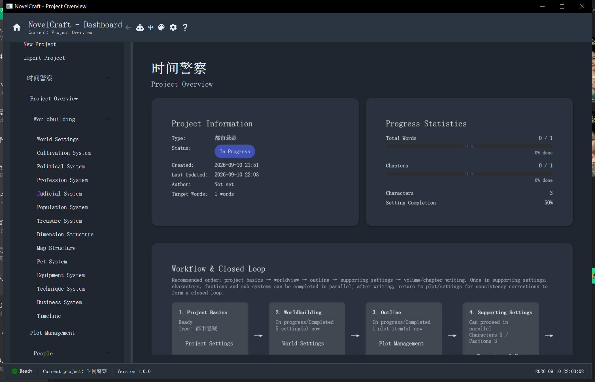

The default page after opening a project. Top: project info card (genre/status/target words) and progress stats (total words, chapters, characters, setting completion). Bottom: the creation pipeline (project info → worldview → outline → settings → volume/chapter writing).

### 4.4 Volumes & Chapters

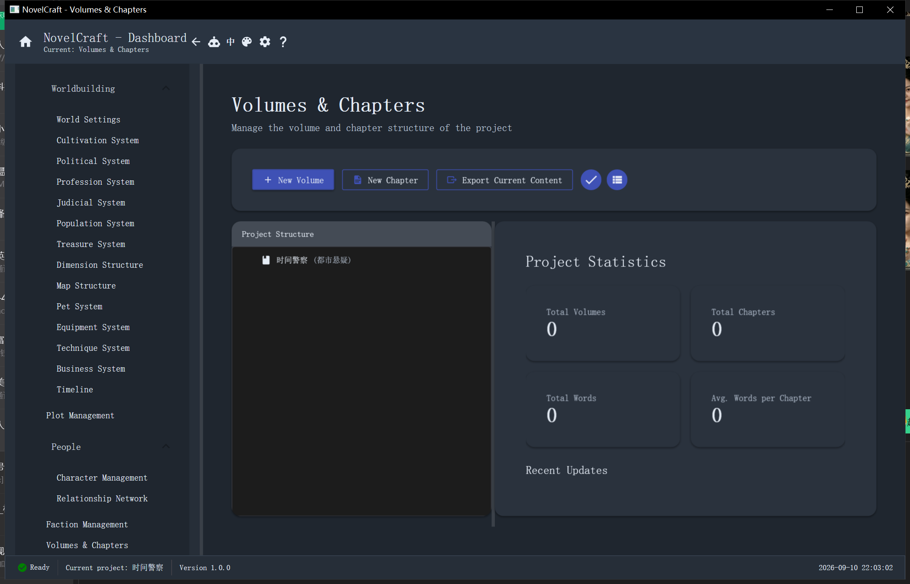

Manages the book structure. Create volumes, add chapters, edit titles/content, reorder and view word counts. Double-click a chapter to open the chapter editor, which provides **AI Polish** and **AI Continue-Writing** (see Section 5).

### 4.5 World Settings (Worldbuilding)

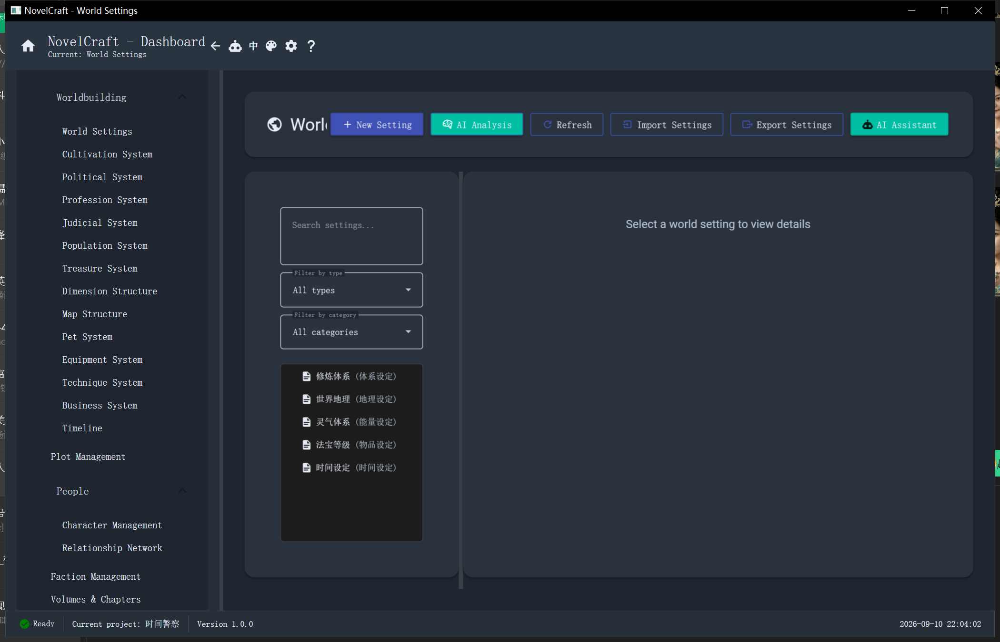

The first sub-page of the Worldbuilding group. Create settings, run AI analysis, import/export; the left panel filters by type/category, the right panel shows details.

> The **Worldbuilding** sidebar group expands into: World Settings, Cultivation System, Political System, Profession System, Judicial System, Population System, Treasure System, Dimension Structure, Map Structure, Pet System, Equipment System, Technique System, Business System and Timeline. All sub-pages share the same interaction pattern.

### 4.6 Plot Management

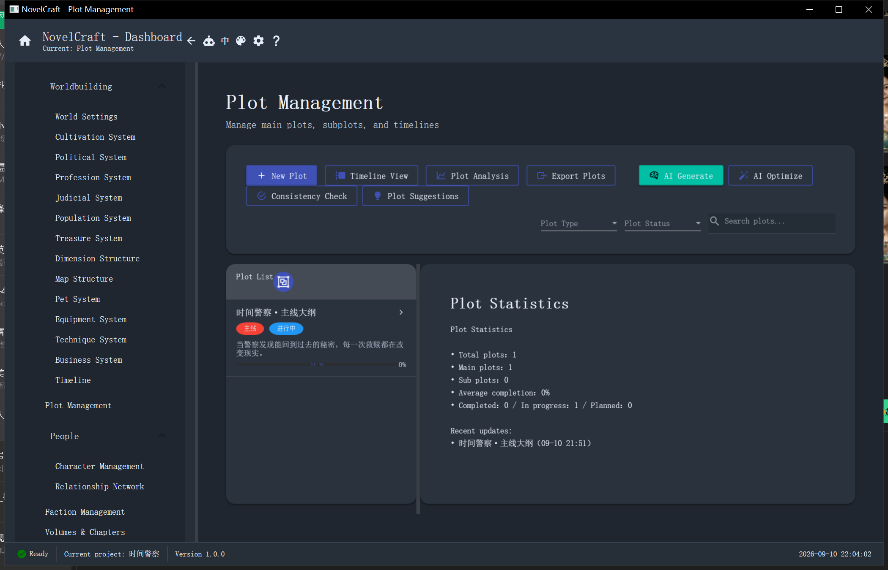

Manages main/side plotlines, foreshadowing and timelines. Create and edit outlines, mark importance (e.g. Importance = 10 for the master synopsis); pipeline artifacts (synopsis, plot lines) are stored here as well.

### 4.7 Character Management

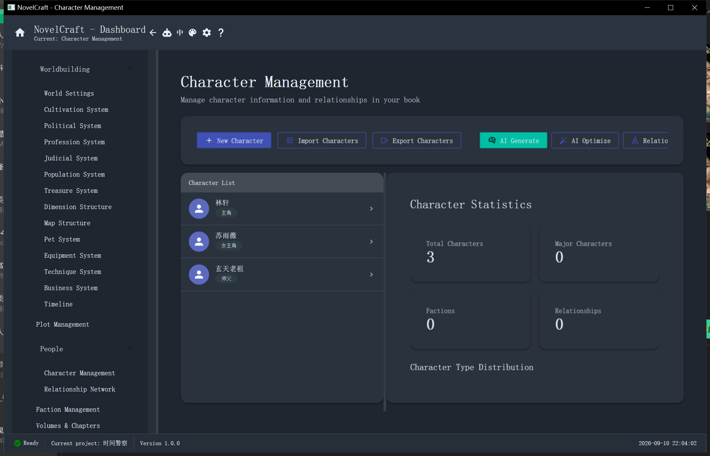

Manages character profiles: name, identity, personality, background and **cultivation level**. The level dropdown auto-loads custom ranks defined in the project's cultivation system and supports automatic level backfill.

### 4.8 Relationship Network

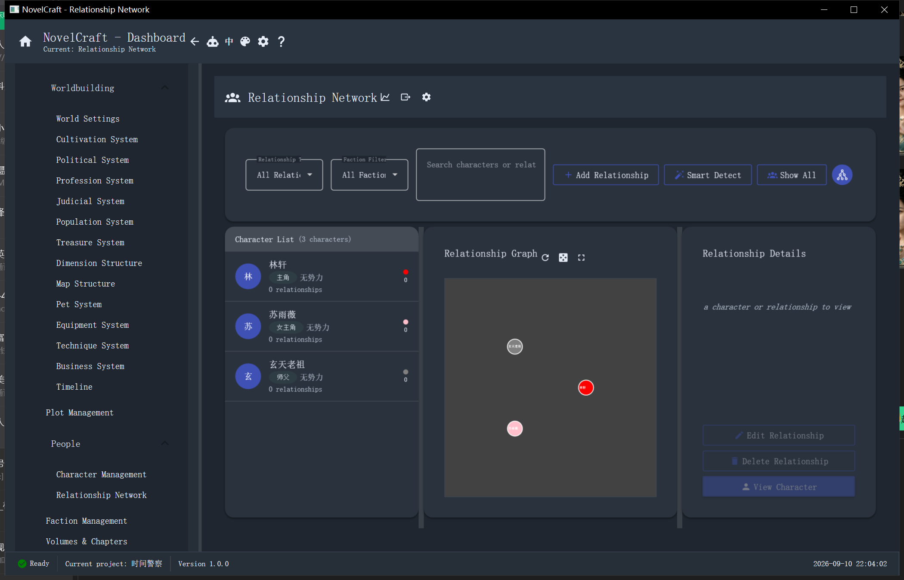

A visual graph of character relationships (mentor/rival/family…). Supports zooming, dragging and relationship editing.

### 4.9 Faction Management

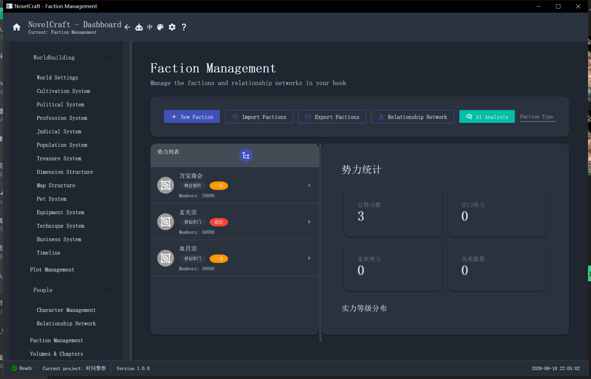

Manages factions (sects, organizations, families), their settings, hierarchy and inter-faction relations.

### 4.10 Cultivation System

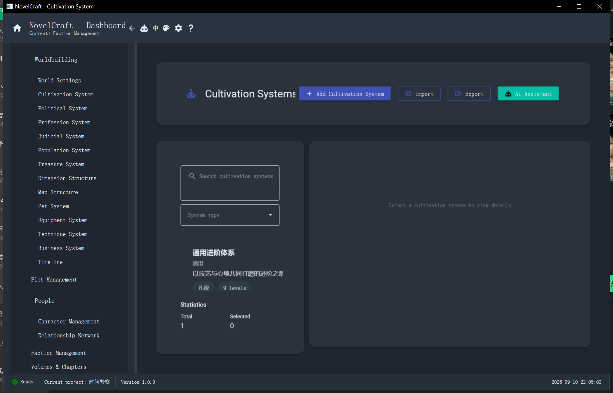

Maintains the book's cultivation rank system, editable manually or generated by RWKV (an 8-rank example: Spirit-Root Resonator → Energy Weaver → … → Reality Shaper → Dimension Weaver). Rank order drives character level backfill and consistency checks.

### 4.11 One-Click Book Generation

> Clicking the sidebar button starts generation immediately (no confirmation dialog) — beware of accidental clicks. Screenshot omitted intentionally.

In the sidebar **AI Assistant** group. One click triggers the RWKV dual-Agent flow: brainstorm a title → generate the synopsis → write chapter one, then auto-create a new project. Progress is shown in the dialog.

### 4.12 Long-Form Batch Generation

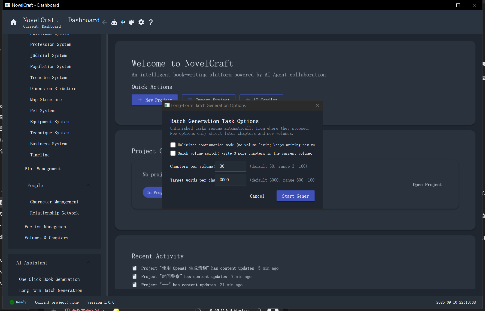

Full-book automated production. The dialog configures:

- **Unlimited mode** — no volume cap; keeps writing until cancelled
- **Fast volume switch** — start the next volume after 3 more chapters (cross-volume continuity check)
- **Chapters per volume** — default 30 (3–100)
- **Target words per chapter** — default 3000 (800–10000)

The task runs in the background with chunked continue-writing and anti-repetition sampling; unfinished tasks auto-resume from the breakpoint. Live progress is available on the **Generation Progress** page.

### 4.13 AI Copilot

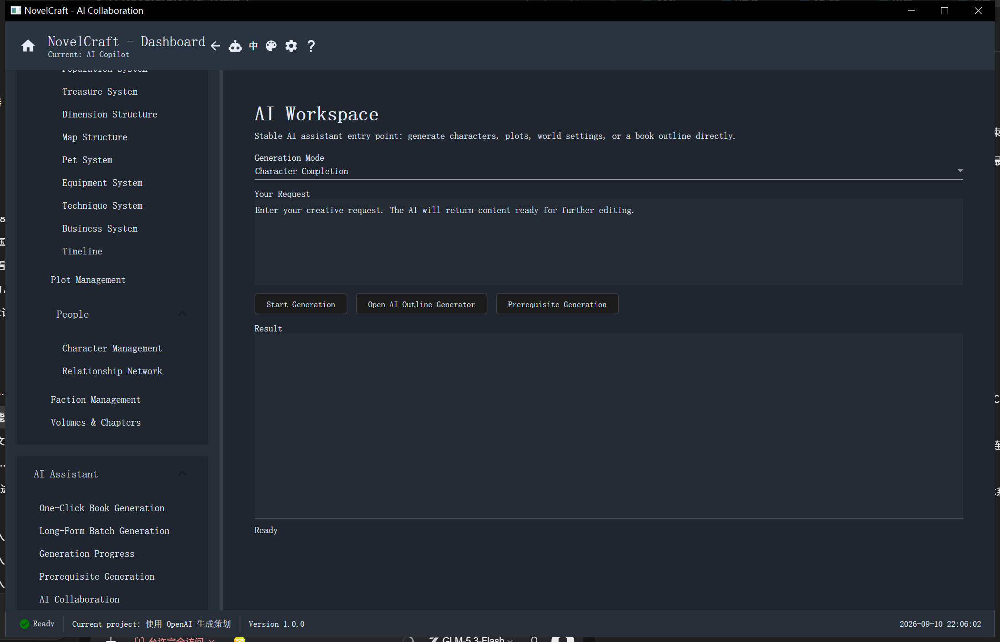

A chat drawer (380 px, right side) toggled by the title-bar robot button. Key capabilities:

- **Intent navigation** — commands like "open plot management" jump directly; natural-language intents use rules first with RWKV fallback
- **Five-stage pipeline** — Synopsis → Plot Lines → Volumes → Chapter Drafts → Chapter Text. Each stage returns a confirmation card supporting per-item accept/edit/discard, accept-all or regenerate
- **Chapter referral** — the link button on the input attaches an existing Book → Volume → Chapter; afterwards the chat rewrites/composes/answers for that chapter directly
- **State resume** — pipeline progress is persisted; you can continue after an app restart

### 4.14 AI Model Configuration

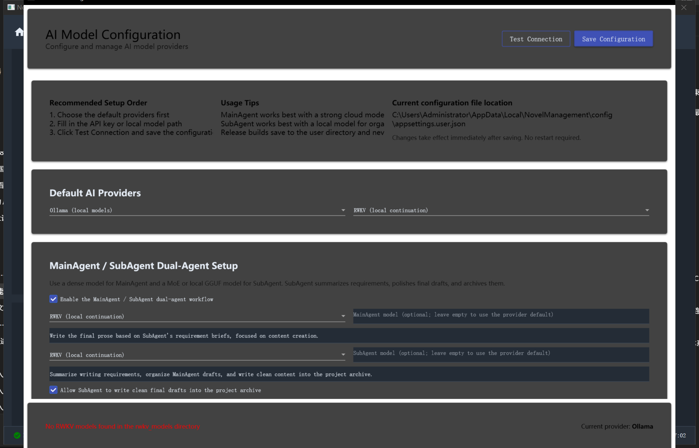

Manages provider integration (RWKV / OpenAI / DeepSeek / Ollama). Key points:

- **Recommended order**: pick the default provider → fill the API key or model path → **Test Connection** → **Save**
- **Dual-Agent flow**: MainAgent (content writing) + SubAgent (requirement briefing & archiving), each with its own provider/model
- **RWKV status**: shows inference-service liveness and the loaded model name; supports local llama.cpp or a remote tunnel (see Section 6)
- Configuration is saved to `%LocalAppData%\NovelManagement\config\appsettings.user.json` (never committed)

### 4.15 Dialogue Generator

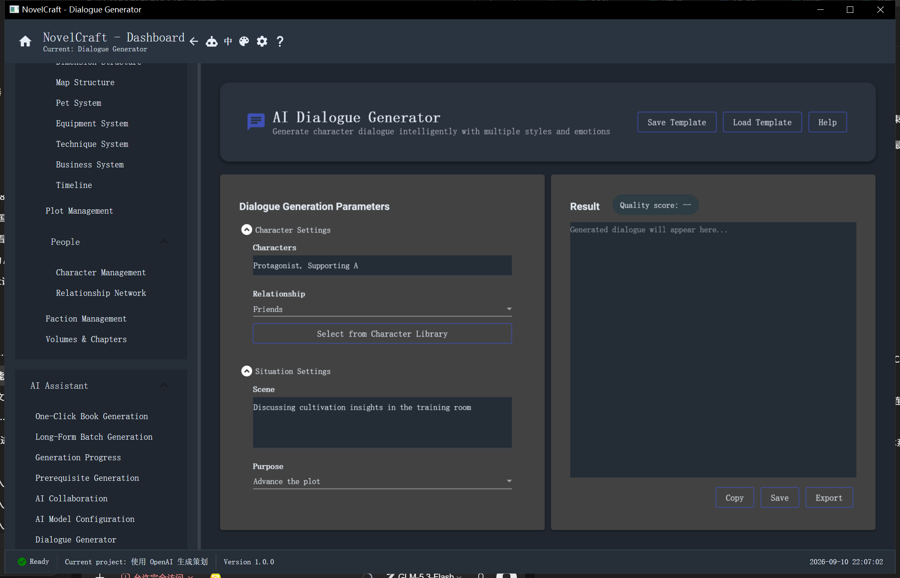

Pick two characters plus a scene and the RWKV dual-Agent workflow produces in-character dialogue, ready to insert into a chapter or copy out.

### 4.16 Consistency Check (Project Health Report)

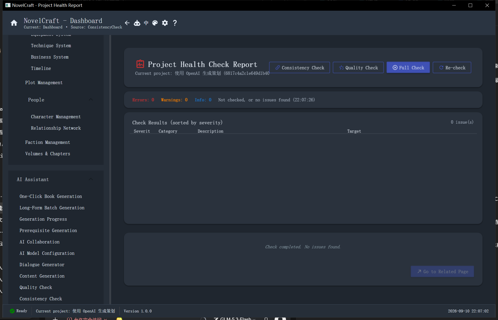

The project health page with four actions: Consistency, Quality, Full check and Re-check. Findings are color-coded as Error / Warning / Info, sorted by severity, each with a target link that jumps to the related page.

### 4.17 Import / Export

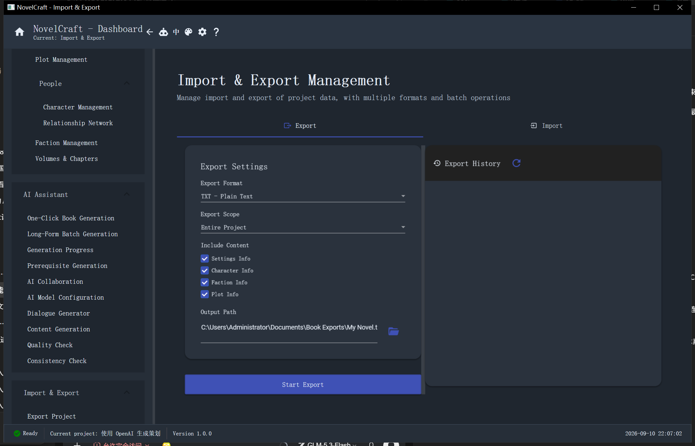

The **Import & Export** sidebar group. Export a full project bundle (book/volumes/chapters/characters/factions/settings/plots), restore from a bundle, and export content as TXT/DOCX. A database backup via Publishing & Maintenance is recommended first.

### 4.18 Publishing & Maintenance

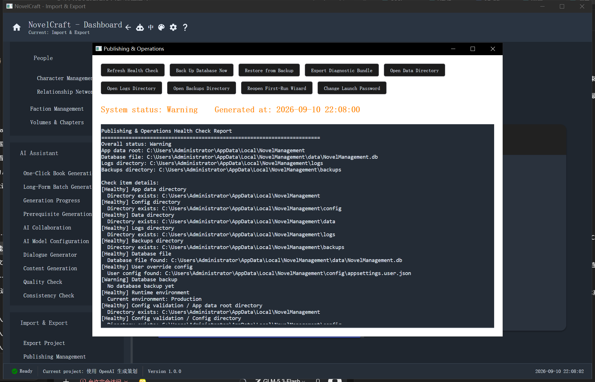

The ops center dialog:

- **One-click actions**: refresh health check / backup now / restore from backup / export diagnostic bundle / open data, log and backup folders / re-run first-run wizard / **change launch password**
- **Health report**: overall status (OK/Warning) with itemized checks (data/config directories, database file, logs, backups, runtime), timestamped in real time
- The diagnostic bundle carries a config snapshot and log digest for issue reporting (sensitive entries are masked)

### 4.19 Statistics Report

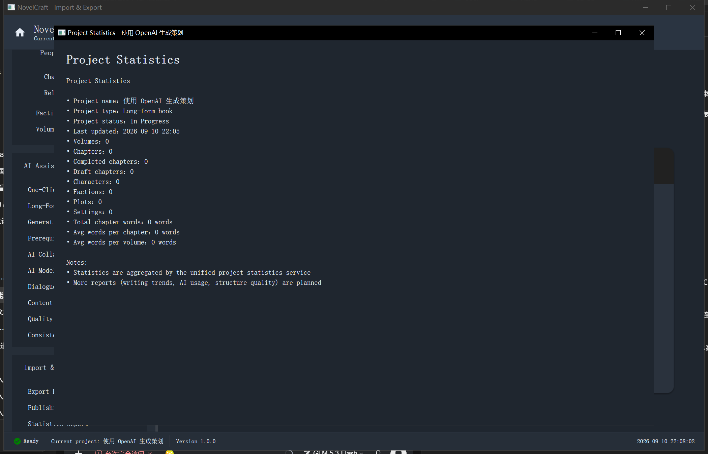

The statistics dialog aggregates: volumes, chapters, completed/draft chapters, characters, factions, plots, settings, total/average words per chapter and per volume.

---

## 5. AI Chapter Polish & Continue-Writing

**AI Polish**:

1. Open a chapter from Volumes & Chapters, select a passage (or none = whole text)
2. Click **AI Polish**
3. The **model dropdown** scans the `rwkv_models` directory for real model files and marks the service-loaded one as "currently online" (selected by default)
4. Choose target style (e.g. Classical), intensity (Medium) and special requirements, then start
5. With a selection, the dialog first confirms the scope (selection vs. whole text); after generation review Preview / Replacements / Suggestions / Quality and click **Apply** — a selection is replaced in place only

**Two-phase liveness probe**: on open, both dialogs run a status-endpoint probe (3 s) plus a 1-token inference probe (6 s); if the service is offline or a black hole (tunnel half-dead), a friendly message directs you to AI Model Configuration instead of a long hang followed by a raw connection error.

**AI Continue-Writing**: click **AI Continue-Writing** in the chapter editor, configure options and generate; the same liveness check runs first.

---

## 6. Using a Remote RWKV Service

The RWKV inference service can run locally (llama.cpp / llama-server) or on a remote machine exposed through a Cloudflare Tunnel. The app talks to it over an OpenAI-compatible HTTP API.

**Configuration** — set the base URL either on the AI Model Configuration page or directly in `appsettings.user.json`:

```json
{
  "AI": { "Providers": { "RWKV": { "BaseUrl": "https://<your-tunnel>.trycloudflare.com" } } }
}
```

A tunnel URL **changes every time the tunnel restarts** — update the base URL after each restart; nothing else needs to change (the model name stays the same).

**Verified setup (Sept 10, 2026)** — remote tunnel with model `rwkv7-g1j-13.3b-20260831-ctx16384-FP16` (13.3 B parameters, FP16, 10240-token context via llama.cpp):

- English creative writing verified end-to-end through the tunnel: coherent, vivid literary prose at ≈ 23–27 tokens/s including tunnel overhead
- Model note: this RWKV world model emits a short chain-of-thought planning preamble before the final prose. Allow enough output budget (max tokens ≥ 1200 for a ~250-word passage) so the final text completes (`finish_reason=stop`), or strip the planning section in post-processing
- The same model name is used unchanged by the application's MainAgent/SubAgent writing flow

**Launch checklist for a local llama-server**:

```
llama-server --port 8000 --model rwkv_models\<model>.gguf --ctx-size 65536 --parallel 4
```

---

## 7. FAQ

**Q1: RWKV shows offline?**
Check the service URL & status on the AI Model Configuration page. Start the local llama-server first (see Section 6). If a remote tunnel restarted, its URL changed — just update `AI:Providers:RWKV:BaseUrl` in `appsettings.user.json`.

**Q2: Where do deleted projects go?**
"Project Management → Recycle Bin"; restore or purge there.

**Q3: The polish model dropdown is empty?**
Ensure `.gguf` files exist under `rwkv_models`. The list combines directory scan + service status; an online service always shows its loaded model.

**Q4: Will batch-generation progress be lost if the machine restarts?**
No. Tasks are persisted per chapter slice and auto-resume on relaunch; see "Generation Progress" for the current volume/chapter and scores.

**Q5: Where is my data and how do I back it up?**
Everything lives under `%LocalAppData%\NovelManagement` (data/config/logs/backups). Use "Publishing & Maintenance → Backup Now"; restore sits in the same dialog.

**Q6: I forgot the launch password.**
Delete the `Security` node in `%LocalAppData%\NovelManagement\config\appsettings.user.json` to restore the factory default password (`RWKV7_20260908`), then set a new one from Publishing & Maintenance.

**Q7: The UI language did not switch everywhere.**
DynamicResource-bound elements refresh immediately; dialogs that were already open keep their old language until reopened. A restart applies the new language to everything.

---

*This manual describes v1.1.0. English screenshots captured from the live en-US build on Sept 10, 2026.*
