# 书籍管理系统 · 项目功能说明书与使用手册
# Novel Management System — Feature Guide & User Manual (Bilingual Edition)

> 版本 Version: 1.0.0 ｜ 更新日期 Updated: 2026-09-08
> 适用平台 Platform: Windows 10/11（.NET 8.0 WPF 桌面应用）

---

## 目录 Table of Contents

1. [项目概述 Project Overview](#1-项目概述-project-overview)
2. [快速开始 Quick Start](#2-快速开始-quick-start)
3. [功能页面使用说明 Page-by-Page User Guide](#3-功能页面使用说明-page-by-page-user-guide)
   - 3.1 仪表盘 Dashboard
   - 3.2 项目管理 Project Management
   - 3.3 项目概览 Project Overview
   - 3.4 卷宗管理 Volumes & Chapters
   - 3.5 设定管理（世界设定）World Settings
   - 3.6 剧情管理 Plot Management
   - 3.7 角色管理 Character Management
   - 3.8 关系网络 Relationship Network
   - 3.9 势力管理 Faction Management
   - 3.10 修炼体系 Cultivation System
   - 3.11 一键生成书籍 One-Click Book Generation
   - 3.12 长篇批量生成 Long-Form Batch Generation
   - 3.13 AI 创作助手 AI Copilot
   - 3.14 AI 模型配置 AI Model Configuration
   - 3.15 对话生成器 Dialogue Generator
   - 3.16 一致性检查（项目体检报告）Consistency Check
   - 3.17 导入导出 Import / Export
   - 3.18 发布管理 Publishing & Maintenance
   - 3.19 统计报告 Statistics Report
4. [AI 章节润色与续写 AI Polish & Continue-Writing](#4-ai-章节润色与续写-ai-polish--continue-writing)
5. [常见问题 FAQ](#5-常见问题-faq)

---

## 1. 项目概述 Project Overview

### 中文

书籍管理系统是一款基于 **C# / .NET 8.0 WPF** 的智能书籍创作与管理平台，面向长篇网文与小说作者。系统以「多 Agent AI 协作」为核心，将 RWKV 本地大语言模型接入创作全流程，覆盖：

- **项目管理**：多书籍项目并行管理，类型/状态/统计一目了然
- **内容创作**：卷宗章节结构化编辑，AI 润色/续写/对话生成
- **设定体系**：世界观、修炼体系、政治/商业/功法/装备等 20+ 维度设定管理
- **AI 流水线**：五级创作流水线（总纲→剧情线→分卷→章节草稿→章节正文）、一键成书、长篇批量生成
- **质量保障**：一致性检查、项目体检报告、统计聚合
- **运维支撑**：SQLite 本地存储、自动备份、健康检查、诊断包导出

### English

The Novel Management System is an intelligent book-writing and management platform built on **C# / .NET 8.0 WPF**, designed for long-form novel authors. Powered by multi-Agent AI collaboration with a locally-hosted RWKV large language model, it covers:

- **Project Management**: manage multiple book projects with type/status/statistics at a glance
- **Content Creation**: structured volume/chapter editing with AI polishing, continue-writing and dialogue generation
- **Setting Systems**: 20+ dimensions including worldview, cultivation system, politics, business, techniques and equipment
- **AI Pipeline**: a five-stage creation pipeline (Synopsis → Plot Lines → Volumes → Chapter Drafts → Chapter Text), one-click book generation and long-form batch generation
- **Quality Assurance**: consistency checking, project health report and aggregated statistics
- **Operations**: local SQLite storage, automatic backup, health check and diagnostic bundle export

### 技术栈 Tech Stack

| 层 Layer | 技术 Technology |
| --- | --- |
| 表现层 UI | WPF (.NET 8.0), UIAutomation |
| 应用层 Application | DI (Microsoft.Extensions.DependencyInjection), Serilog |
| 领域层 Domain | 项目/卷宗/章节/人物/势力/设定领域服务 |
| 基础设施 Infrastructure | SQLite + EF Core, RWKV llama.cpp 推理服务 |
| AI 集成 AI | RWKV (本地优先), OpenAI / DeepSeek / Ollama (可选) |

---

## 2. 快速开始 Quick Start

### 中文

1. **启动**：双击 `NovelManagement.WPF.exe`，进入仪表盘首页。
2. **新建项目**：仪表盘点击「＋ 新建项目」，填写书名、类型（如修仙小说/都市悬疑）后创建。
3. **打开项目**：在「项目管理」页点击目标项目的「打开项目」图标按钮，侧栏随即展开该项目的功能树。
4. **AI 能力（可选）**：到「AI 模型配置」页确认 RWKV 推理服务状态为在线；未部署时可先使用纯手动创作。
5. **开始创作**：按「设定管理 → 剧情管理 → 卷宗管理」顺序构建书籍骨架，或直接使用「AI 创作助手」对话式生成。

### English

1. **Launch**: double-click `NovelManagement.WPF.exe`; the Dashboard appears.
2. **Create**: click "＋ New Project" on the Dashboard, fill in the title and genre, then create.
3. **Open**: on the Project Management page, click the "Open Project" icon button of a project; its function tree expands in the sidebar.
4. **AI (optional)**: on the AI Model Configuration page, ensure the RWKV inference service shows *Online*. Pure manual writing works without it.
5. **Write**: build the book skeleton via World Settings → Plot → Volumes, or simply chat with the AI Copilot.

### 环境要求 Requirements

- Windows 10/11 x64，.NET 8.0 Desktop Runtime
- （可选）RWKV 推理服务：本地 llama.cpp 或远程隧道，详见 3.14
- 数据目录：`%LocalAppData%\NovelManagement`（数据库、日志、备份、用户配置）

---

## 3. 功能页面使用说明 Page-by-Page User Guide

### 3.1 仪表盘 Dashboard

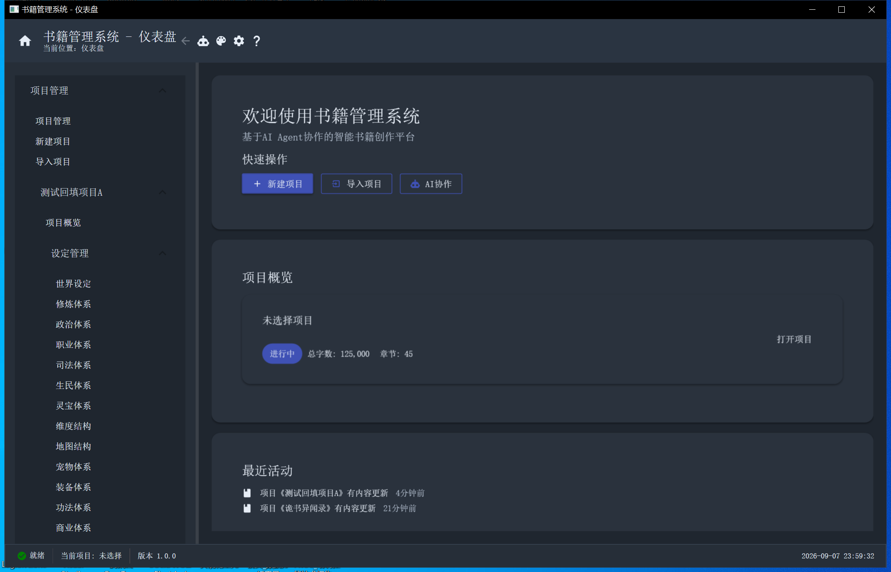

**中文**：启动首页。提供「新建项目 / 导入项目 / AI 协作」快捷入口、项目概览卡（总字数/章节数）与最近活动时间线。未打开项目时显示「未选择项目」。

**English**: the launch page. Offers quick actions (New / Import / AI Collaboration), a project overview card (total words & chapters) and a recent-activity timeline.

---

### 3.2 项目管理 Project Management

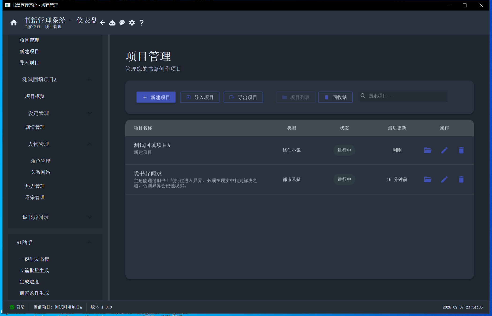

**中文**：项目中枢。工具栏提供「新建项目 / 导入项目 / 导出项目 / 项目列表 / 回收站 / 搜索」。列表展示每个项目的类型、状态（进行中等）、最近更新时间，行尾三个图标按钮分别为：打开项目、编辑项目、删除项目。删除的项目进入回收站可恢复。

**English**: the project hub. Toolbar offers New / Import / Export / List / Recycle Bin / Search. Each row shows genre, status, last-updated time and three icon actions: Open, Edit, Delete (soft-delete to Recycle Bin).

> 提示 Tip：图标按钮的悬停提示（ToolTip）即为按钮功能名，如「打开项目」。

---

### 3.3 项目概览 Project Overview

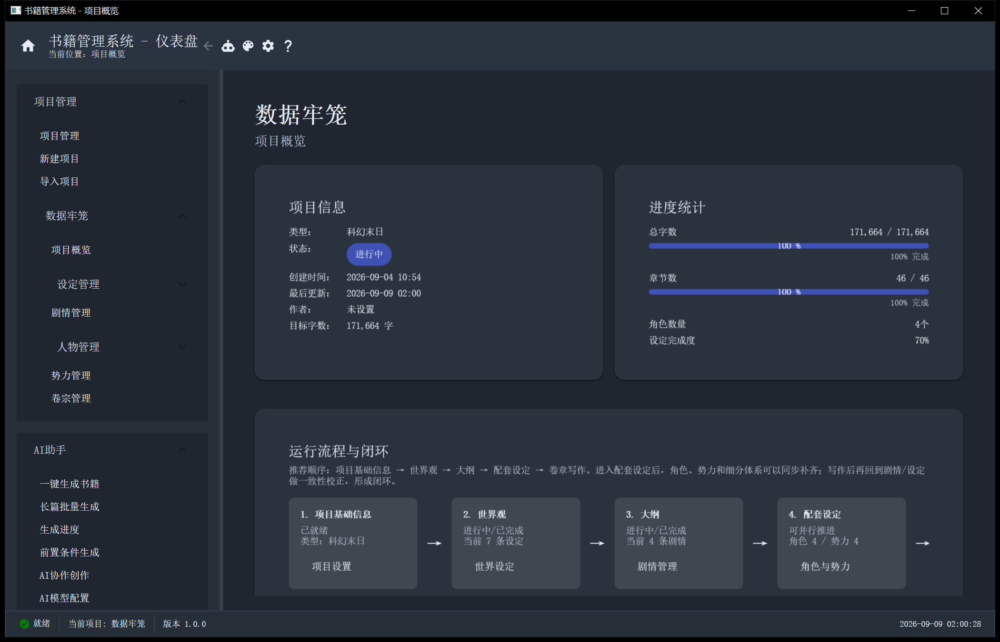

**中文**：打开项目后的默认页。左侧统计卡展示完成度（如 100% 完成、6/10 章节、进度百分比），中部为项目信息与最近剧情/设定回执，右侧可跳转各管理页。

**English**: the default page after opening a project. Left stat cards show completion (e.g. 6/10 chapters), center shows project info and recent plot/setting receipts, right side links to all management pages.

---

### 3.4 卷宗管理 Volumes & Chapters

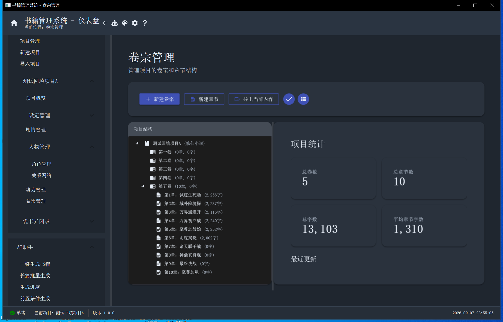

**中文**：书籍结构管理页。支持新建分卷、在卷内新建章节、编辑章节标题与正文、排序与统计字数。双击章节进入章节编辑器；编辑器内提供「AI 润色」「AI 续写」按钮（详见第 4 节）。

**English**: manages the book structure. Create volumes, add chapters, edit titles/content, reorder and view word counts. Double-click a chapter to open the chapter editor, which provides "AI Polish" and "AI Continue-Writing" (see Section 4).

---

### 3.5 设定管理（世界设定）World Settings

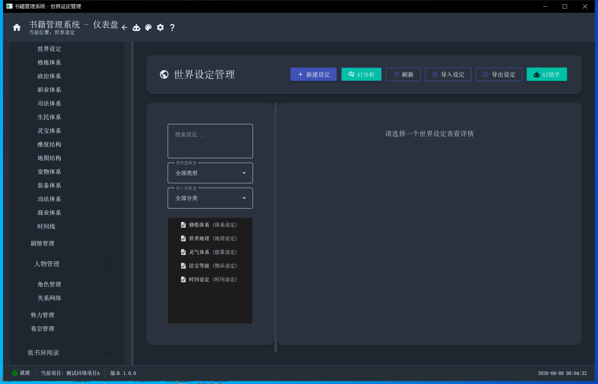

**中文**：设定管理的第一个子页。支持新建设定、AI 分析、导入/导出设定；左侧检索区可按类型/分类过滤（如「修炼体系（体系设定）」「世界地理（地理设定）」），右侧为设定详情。

**English**: the first sub-page of Setting Management. Create settings, run AI analysis, import/export; the left panel filters by type/category (e.g. Cultivation System, World Geography), the right panel shows details.

> 侧栏「设定管理」是一个分组，展开后包含：世界设定、修炼体系、政治体系、职业体系、司法体系、生民体系、灵宝体系、维度结构、地图结构、宠物体系、装备体系、功法体系、商业体系、时间线等子页，操作方式与世界观设定一致。
> The "Setting Management" sidebar group expands into: World Settings, Cultivation System, Politics, Professions, Justice, Population, Treasures, Dimensions, Maps, Pets, Equipment, Techniques, Business, Timeline, etc. All sub-pages share the same interaction pattern.

---

### 3.6 剧情管理 Plot Management

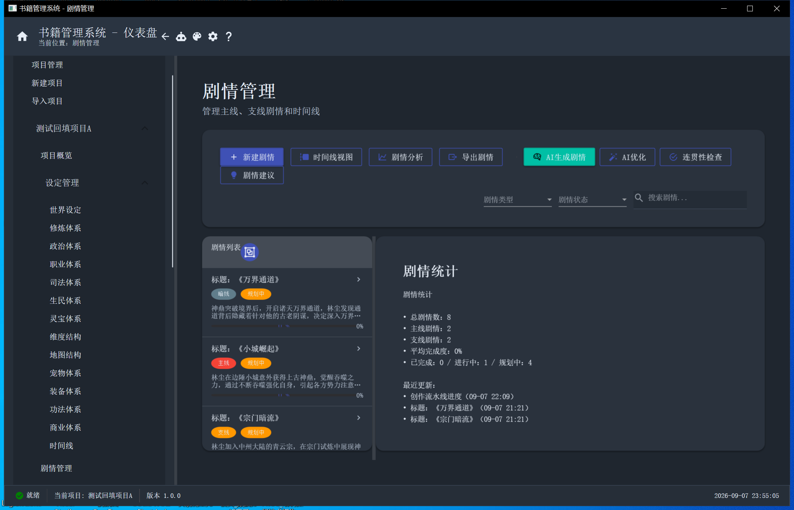

**中文**：管理主线/支线大纲、伏笔与时间线。支持新建剧情线、编辑大纲内容、标记重要级（如 Importance=10 的总纲）；AI 创作流水线的产物（总纲、剧情线）也落库于本页。

**English**: manages main/side plotlines, foreshadowing and timelines. Create and edit outlines, mark importance (e.g. Importance=10 for the master synopsis); pipeline artifacts (synopsis, plot lines) are also stored here.

---

### 3.7 角色管理 Character Management

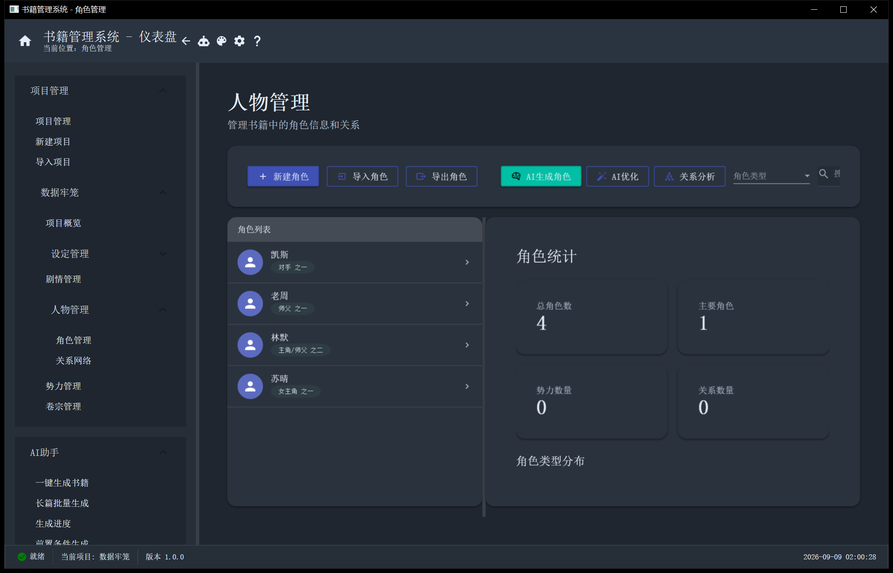

**中文**：角色档案管理。记录姓名、身份、性格、背景与**修为等级**；修为下拉框会自动加载本项目修炼体系中的自定义等级（如「灵根共鸣者→…→维度织者」），并支持按体系等级自动回填。

**English**: manages character profiles (name, identity, personality, background and **cultivation level**). The level dropdown auto-loads custom ranks defined in the project's cultivation system and supports automatic level backfill.

---

### 3.8 关系网络 Relationship Network

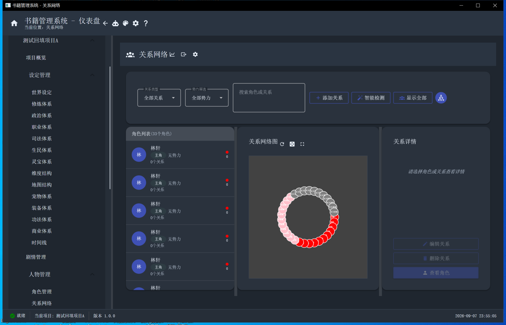

**中文**：可视化角色关系图谱。以节点+连线展示人物关系（师徒/敌对/亲属等），支持缩放、拖拽与关系编辑。

**English**: a visual graph of character relationships (mentor/rival/family...). Supports zooming, dragging and relationship editing.

---

### 3.9 势力管理 Faction Management

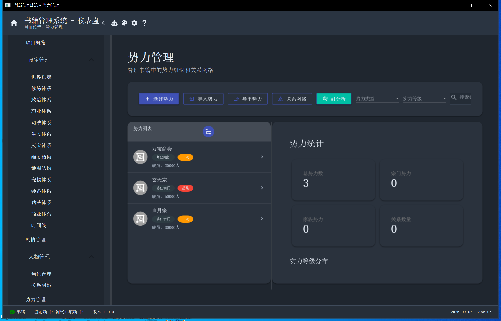

**中文**：门派/组织/家族等势力档案管理，记录势力设定、层级结构与相互关系。

**English**: manages factions (sects, organizations, families), their settings, hierarchy and inter-faction relations.

---

### 3.10 修炼体系 Cultivation System

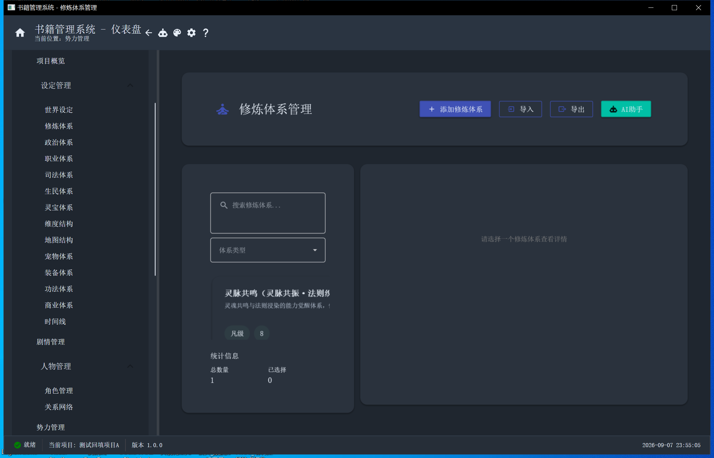

**中文**：维护本书的修炼等级体系。支持手工编辑，也可由 RWKV 生成自定义体系（八级示例：灵根共鸣者→能量编织者→…→现实编织者→维度织者）。等级顺序（Order）用于角色修为回填与一致性检查。

**English**: maintains the book's cultivation rank system, editable manually or generated by RWKV (an 8-rank example: Spirit-Root Resonator → Energy Weaver → … → Reality Shaper → Dimension Weaver). Rank order drives character level backfill and consistency checks.

---

### 3.11 一键生成书籍 One-Click Book Generation

> 该功能点击侧栏按钮后立即开始生成（无确认弹窗），请注意误触。截图从略，避免触发生成任务。
> Clicking the sidebar button starts generation immediately (no confirmation dialog) — beware of accidental clicks. Screenshot omitted intentionally.

**中文**：位于侧栏「AI 助手」组。点击后由 RWKV 双 Agent 自动完成：构思书名 → 生成大纲 → 生成第一章，并自动创建新项目。适合快速获取创意样本；生成过程可在弹窗进度条中观察。

**English**: in the sidebar "AI Assistant" group. One click triggers the RWKV dual-Agent flow: brainstorm a title → generate the synopsis → write chapter one, then auto-create a new project. Ideal for quick creative samples; progress is shown in the dialog.

---

### 3.12 长篇批量生成 Long-Form Batch Generation

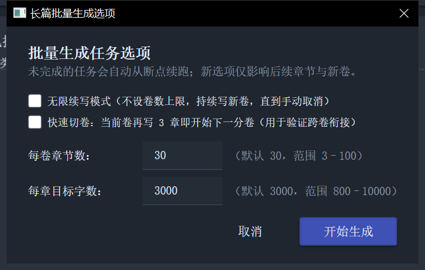

**中文**：整本长篇自动化生产。弹窗中可配置：

- **无限续写模式**：不设卷数上限，持续写新卷直到手动取消
- **快速切卷**：当前卷再写 3 章即开始下一分卷（用于验证跨卷衔接）
- **每卷章节数**：默认 30（范围 3–100）
- **每章目标字数**：默认 3000（范围 800–10000）

任务后台运行，采用切片续写 + 防复读工艺；未完成任务自动从断点续跑，新选项仅影响后续章节与新卷。进度可在侧栏「生成进度」页实时查看。

**English**: full-book automated production. The dialog configures:

- **Unlimited mode**: no volume cap; keeps writing until cancelled
- **Fast volume switch**: start the next volume after 3 more chapters (to verify cross-volume continuity)
- **Chapters per volume**: default 30 (3–100)
- **Target words per chapter**: default 3000 (800–10000)

The task runs in the background with chunked continue-writing and anti-repetition; unfinished tasks auto-resume from the breakpoint, and new options only affect subsequent chapters/volumes. Live progress is available on the "Generation Progress" page.

---

### 3.13 AI 创作助手 AI Copilot

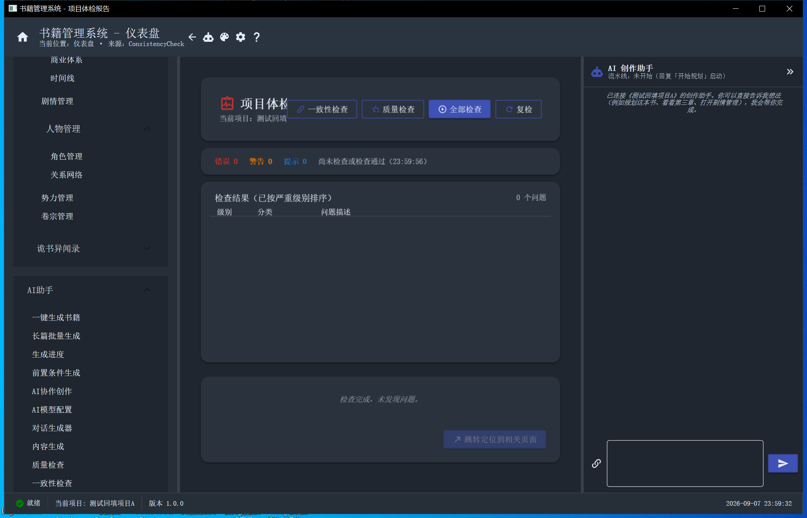

**中文**：标题栏机器人按钮开合的对话式创作抽屉（右侧 380px）。核心能力：

- **意图导航**：输入「打开剧情管理」等指令直接跳页；自然语言由规则优先 + RWKV 兜底解析
- **五级流水线**：总纲 → 剧情线 → 分卷 → 章节草稿 → 章节正文，每级产出以「确认卡」呈现，支持单项采纳/修改/放弃、整卡全部采纳或重新生成
- **章节关联处理**：输入框左侧链接按钮可关联已有 书→卷→章，此后对话直接对目标章节改写/成文/答疑；发送「取消关联」解除
- **状态恢复**：流水线进度持久化，重启应用后可继续创作

**English**: a chat drawer (380px, right side) toggled by the title-bar robot button. Key capabilities:

- **Intent navigation**: commands like "open plot management" jump directly; NL intents use rules first with RWKV fallback
- **Five-stage pipeline**: Synopsis → Plot Lines → Volumes → Chapter Drafts → Chapter Text. Each stage returns a confirmation card supporting per-item accept/edit/discard, accept-all or regenerate
- **Chapter referral**: the link button on the input attaches an existing Book → Volume → Chapter; afterwards the chat rewrites/composes/answers for that chapter directly; send "取消关联" to unlink
- **State resume**: pipeline progress is persisted; you can continue after an app restart

---

### 3.14 AI 模型配置 AI Model Configuration

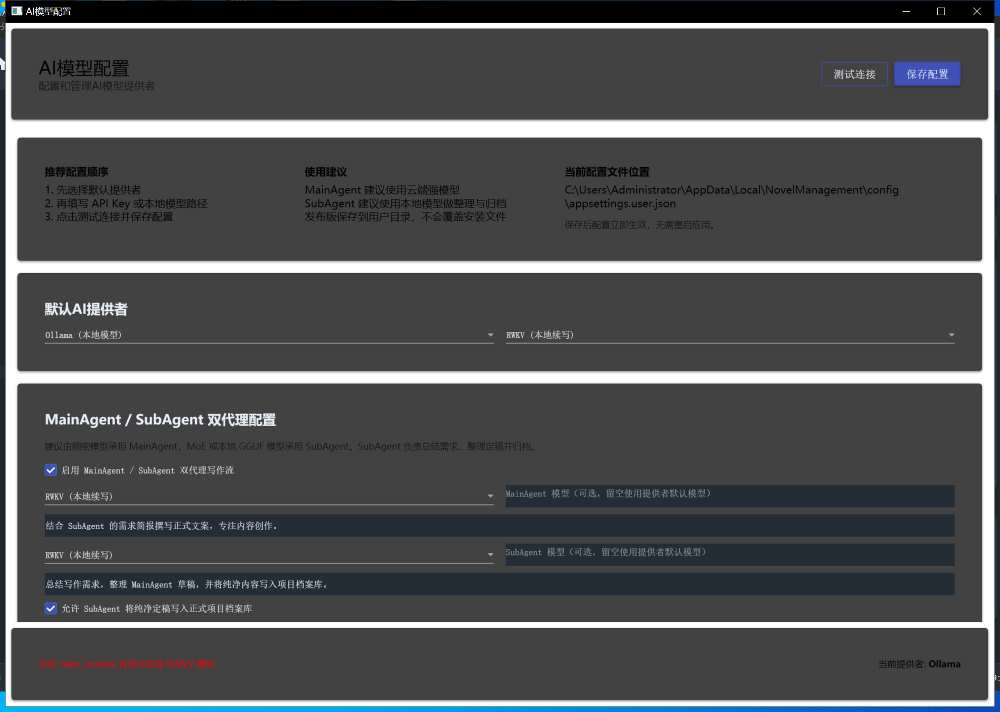

**中文**：管理与 RWKV / OpenAI / DeepSeek / Ollama 等提供者的对接。要点：

- **推荐配置顺序**：先选默认提供者 → 填 API Key 或本地模型路径 → 点击「测试连接」→「保存配置」
- **双代理写作流**：MainAgent（正文创作）+ SubAgent（需求整理与归档），均可指定提供者与模型
- **RWKV 状态**：页面显示推理服务在线状态与已加载模型名；服务地址支持本地 llama.cpp 或远程隧道
- 配置保存于 `%LocalAppData%\NovelManagement\config\appsettings.user.json`（不入库、不覆盖发行文件）

**English**: manages provider integration (RWKV / OpenAI / DeepSeek / Ollama). Key points:

- **Recommended order**: pick the default provider → fill the API key or local model path → "Test Connection" → "Save"
- **Dual-Agent flow**: MainAgent (content writing) + SubAgent (requirement briefing & archiving), each with its own provider/model
- **RWKV status**: shows inference-service liveness and the loaded model name; supports local llama.cpp or a remote tunnel
- Configuration is saved to `%LocalAppData%\NovelManagement\config\appsettings.user.json` (never committed)

---

### 3.15 对话生成器 Dialogue Generator

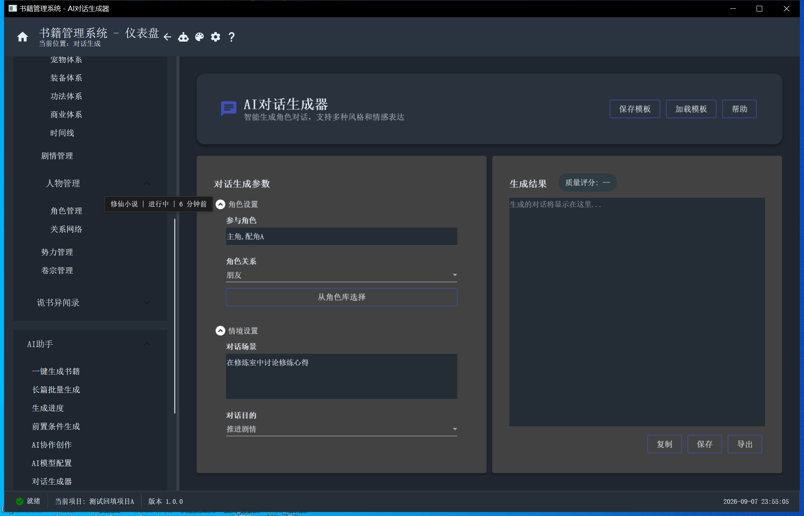

**中文**：角色对话生成工具。选择两个角色并给定场景，由 RWKV 双 Agent 工作流生成符合人设的对话文本，可一键插入章节或复制导出。

**English**: a dialogue generator. Pick two characters plus a scene and the RWKV dual-Agent workflow produces in-character dialogue, ready to insert into a chapter or copy out.

---

### 3.16 一致性检查（项目体检报告）Consistency Check

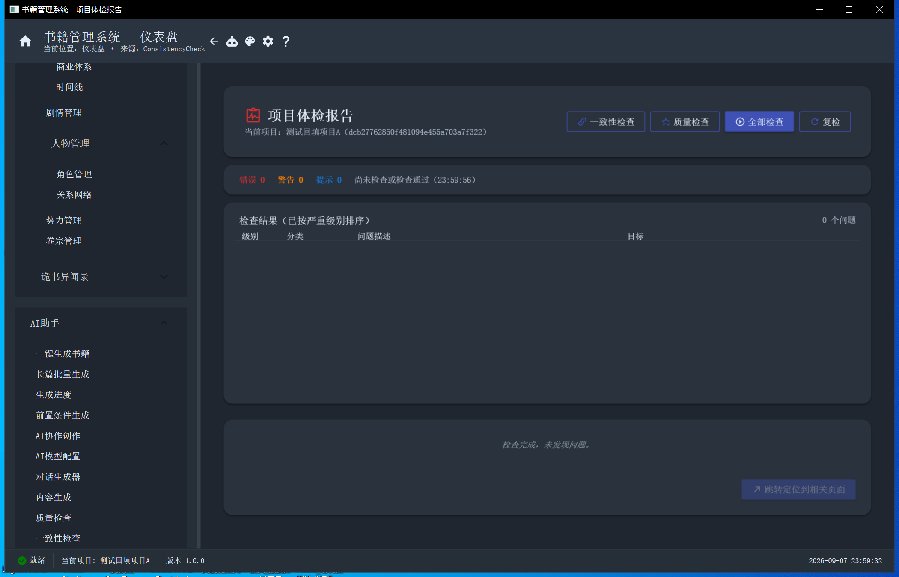

**中文**：项目质量体检页，提供四种检查：一致性检查、质量检查、全部检查、复检。结果按「错误/警告/提示」三级着色并按严重级别排序，每条问题附目标定位可一键跳转对应页面。当前项目与项目 ID 显示在卡片头部。

**English**: the project health page with four actions: Consistency, Quality, Full check and Re-check. Findings are color-coded as Error/Warning/Info, sorted by severity, each with a target link that jumps to the related page.

---

### 3.17 导入导出 Import / Export

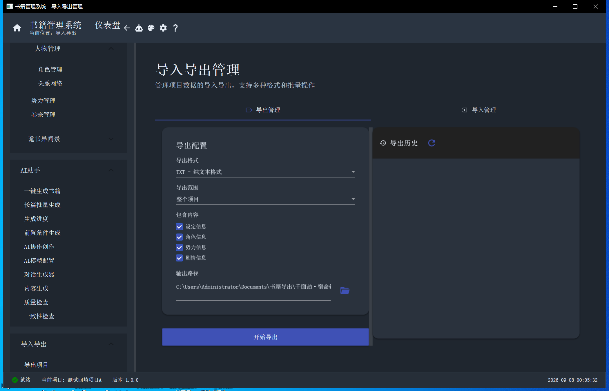

**中文**：侧栏「导入导出」组。支持项目整包导出（含书籍/卷章/人物/势力/设定/剧情）、从导出包导入恢复，以及 TXT/DOCX 等格式的内容导出。导出前建议先在「发布管理」做一次数据库备份。

**English**: the "Import/Export" sidebar group. Export a full project bundle (book/volumes/chapters/characters/factions/settings/plots), restore from a bundle, and export content as TXT/DOCX. A database backup via Publishing & Maintenance is recommended first.

---

### 3.18 发布管理 Publishing & Maintenance

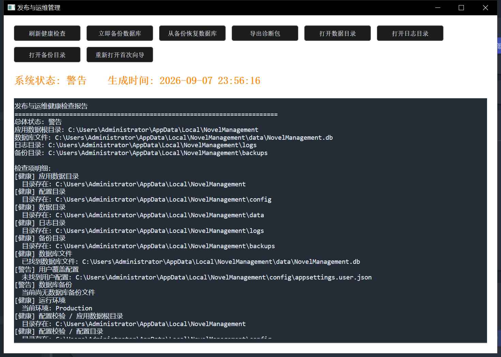

**中文**：「发布与运维管理」弹窗，是系统运维中心：

- **一键操作**：刷新健康检查 / 立即备份数据库 / 从备份恢复 / 导出诊断包 / 打开数据目录 / 打开日志目录 / 打开备份目录 / 重新打开首次向导
- **健康检查报告**：总状态（正常/警告）+ 逐项检查（应用数据目录、配置目录、数据库文件、日志、备份、运行环境等），生成时间实时
- 诊断包含配置快照与日志摘要，用于问题上报（自动脱敏敏感项）

**English**: the "Publishing & Maintenance" dialog, the ops center:

- **One-click actions**: refresh health check / backup now / restore from backup / export diagnostic bundle / open data / log / backup folders / re-run first-run wizard
- **Health report**: overall status (OK/Warning) with itemized checks (data/config directories, database file, logs, backups, runtime), timestamped in real time
- The diagnostic bundle carries a config snapshot and log digest for issue reporting (sensitive entries are masked)

---

### 3.19 统计报告 Statistics Report

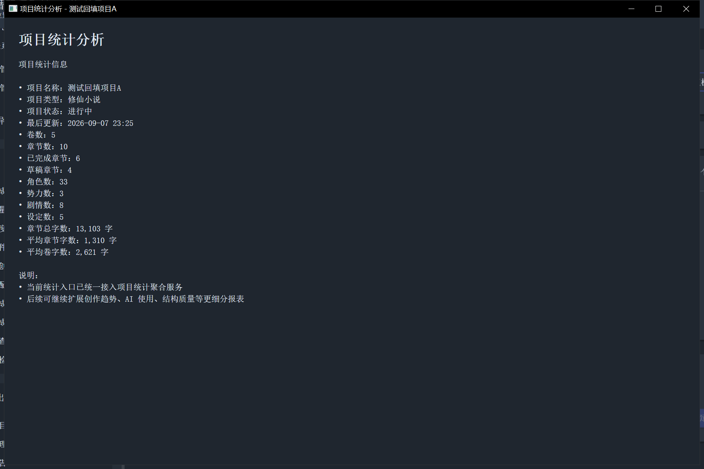

**中文**：「项目统计分析」弹窗，聚合展示当前项目：卷数、章节数、已完成/草稿章节数、角色数、势力数、剧情数、设定数、章节总字数、平均每章字数、平均每卷字数等指标，为后续创作趋势与 AI 使用分析预留扩展。

**English**: the "Project Statistics" dialog aggregates: volumes, chapters, completed/draft chapters, characters, factions, plots, settings, total/average words per chapter and per volume, with room for future trend & AI-usage analytics.

---

## 4. AI 章节润色与续写 AI Polish & Continue-Writing

### 中文（2026-09 修复后的完整流程）

**AI 润色**：

1. 在卷宗管理双击章节打开编辑器，选中一段文本（或不选=全文润色）
2. 点击「AI 润色」打开润色弹窗
3. **模型下拉框**自动扫描 `rwkv_models` 目录列出真实模型文件，并标记 RWKV 服务「当前在线」的模型为默认选中
4. 选择目标风格（如古典雅致）、润色强度（中度润色）与特殊要求，点击「开始润色」
5. 若选中了文本，弹窗先确认润色范围（所选段/全文）；完成后可查看「润色预览 / 替换项 / 智能建议 / 质量分析」，点「应用润色」精准写回（选中文本仅替换选中段）

**服务在线两级探测**：润色/续写弹窗打开时执行「状态端点 3 秒 + 1-token 推理 6 秒」两级探测；服务离线或推理黑洞（隧道假死）时立即提示前往「AI 模型配置」页启动服务，避免长时间等待后报裸英文连接错误。

**AI 续写**：章节编辑器内点击「AI 续写」，在设置面板配置续写参数后生成；同样前置 RWKV 在线检查。

### English (post-fix workflow, Sept 2026)

**AI Polish**:

1. Open a chapter from Volumes & Chapters, select a passage (or none = whole text)
2. Click "AI Polish"
3. The **model dropdown** scans the `rwkv_models` directory for real model files and marks the service-loaded one as "currently online" (selected by default)
4. Choose target style (e.g. Classical), intensity (Medium) and special requirements, then start
5. With a selection, the dialog first confirms the scope (selection vs. whole text); after generation review Preview / Replacements / Suggestions / Quality and click "Apply" — a selection is replaced in place only

**Two-phase liveness probe**: on open, both dialogs run a status-endpoint probe (3s) plus a 1-token inference probe (6s); if the service is offline or a black hole (tunnel half-dead), a friendly message directs you to AI Model Configuration instead of a long hang followed by a raw English connection error.

**AI Continue-Writing**: click "AI Continue-Writing" in the chapter editor, configure options and generate; the same liveness check runs first.

---

## 5. 常见问题 FAQ

**Q1 中文：RWKV 显示离线？**
A：到「AI 模型配置」页查看服务地址与状态。本地服务先启动 llama-server（示例：`--port 8000 --model rwkv_models\rwkv7-g1j-2.9b-Q8_0.gguf --ctx-size 65536 --parallel 4`）；远程隧道重启后 URL 会变，只需更新 `%LocalAppData%\NovelManagement\config\appsettings.user.json` 的 `AI:Providers:RWKV:BaseUrl`。

**Q1 English: RWKV shows offline?**
A: Check the service URL & status on the AI Model Configuration page. Start the local llama-server first (e.g. `--port 8000 --model rwkv_models\rwkv7-g1j-2.9b-Q8_0.gguf --ctx-size 65536 --parallel 4`). If a remote tunnel restarted, its URL changed — just update `AI:Providers:RWKV:BaseUrl` in `appsettings.user.json`.

**Q2 中文：删除的项目去哪了？**
A：进入「项目管理 → 回收站」，可恢复或彻底删除。

**Q2 English: where do deleted projects go?**
A: "Project Management → Recycle Bin"; restore or purge there.

**Q3 中文：润色弹窗里模型下拉是空的？**
A：确认 `rwkv_models` 目录下存在 `.gguf` 模型文件；目录扫描与服务状态共同决定下拉内容。服务在线时至少会显示当前加载的模型。

**Q3 English: the polish model dropdown is empty?**
A: ensure `.gguf` files exist under `rwkv_models`. The list combines directory scan + service status; an online service always shows its loaded model.

**Q4 中文：批量生成中途关机会丢进度吗？**
A：不会。任务按章节切片落库，重启应用后从断点自动续跑；侧栏「生成进度」可查看当前卷/章与评分。

**Q4 English: will progress be lost if the machine restarts?**
A: No. Tasks are persisted per chapter slice and auto-resume on relaunch; see "Generation Progress" for the current volume/chapter and scores.

**Q5 中文：数据存在哪里？如何备份？**
A：全部数据在 `%LocalAppData%\NovelManagement`（data/config/logs/backups）。用「发布管理 → 立即备份数据库」一键备份，恢复同样在该弹窗完成。

**Q5 English: where is my data and how to back it up?**
A: everything lives under `%LocalAppData%\NovelManagement` (data/config/logs/backups). Use "Publishing & Maintenance → Backup Now"; restore sits in the same dialog.

---

*本说明书截图取自 v1.0.0 真实运行界面（2026-09-07）。Screenshots captured from the live v1.0.0 build (Sept 7, 2026).*
